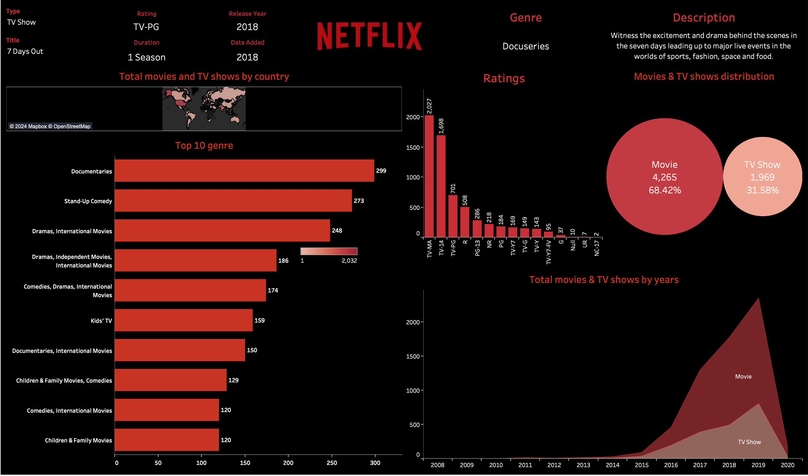

# 📊 Netflix Data Visualization Dashboard

Welcome to the **Netflix Data Visualization Dashboard**, a dynamic and interactive Tableau project that provides deep insights into Netflix's data, including genre distribution, ratings trends, and geographic content analysis.

---

## 🌟 Highlights of the Dashboard

  
*Above: An engaging snapshot of the Netflix Dashboard showcasing key insights.*  

---

## 🚀 Project Overview

This project is designed to analyze Netflix data with the following steps:

- **SQL**: Extracted and transformed data from the Netflix dataset.
- **Python**: Cleaned and preprocessed data to prepare it for visualization.
- **Tableau**: Built an interactive dashboard to reveal trends and insights.

---

## 🖼️ Key Visuals and Features

- 📂 **Genre Distribution**: A clear breakdown of genres across Netflix's catalog.
- ⭐ **Ratings Trends**: Insights into the evolution of content ratings over time.
- 🌍 **Global Reach**: A map-based visualization showing geographic distribution.

---

## 🎯 Explore the Dashboard

🔗 **[Click here to view the live Tableau Dashboard](https://public.tableau.com/shared/24XRJFTPW?:display_count=n&:origin=viz_share_link)**  

---

## 🛠️ Technical Details

| **Tool/Technology** | **Purpose**                           |
|----------------------|---------------------------------------|
| **SQL**             | Data extraction and transformation   |
| **Python**          | Data cleaning and preprocessing      |
| **Tableau**         | Interactive visualization creation   |

---

## 📥 How to Use This Repository

1. Clone the repository:  
   ```bash
   git clone https://github.com/tuanvukng01/netflix_dashboard.git
   ```
2. Review the SQL and Python scripts in the `/scripts` folder.
3. Upload preprocessed data to Tableau or directly open the provided `.twbx` file.

---

[//]: # (## 📂 Repository Structure)

[//]: # ()
[//]: # (```plaintext)

[//]: # (/)

[//]: # (├── data/                   # Sample dataset &#40;if permissible&#41;)

[//]: # (├── scripts/                # Python and SQL scripts)

[//]: # (├── tableau/                # Tableau Packaged Workbook &#40;.twbx&#41;)

[//]: # (├── README.md               # This file)

[//]: # (```)

[//]: # ()
[//]: # (---)

[//]: # (## 📋 Acknowledgments)

[//]: # ()
[//]: # (- 📁 **Dataset**: Provided by [Netflix Open Data Initiative]&#40;https://netflix.com&#41;.)

[//]: # (- 🎨 Icons by [Icons8]&#40;https://icons8.com&#41;.)

[//]: # ()
[//]: # (---)

> **Note:** This dashboard is a demonstration of skills in data visualization and analysis. The dataset and insights are for illustrative purposes only.

